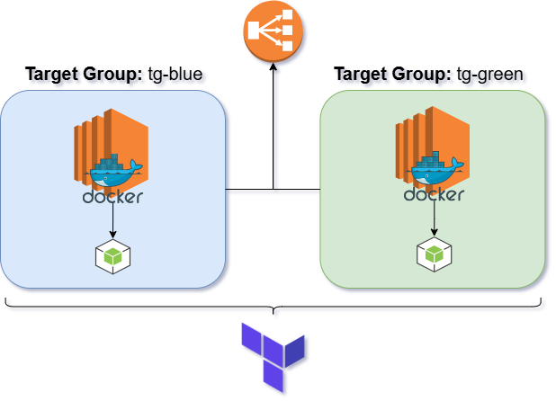

# DevOps Test Project: Blue/Green Deployment on AWS

## Project Overview

This repository is a **DevOps practice Sandbox** designed to help test and develop essential skills in infrastructure as code (IaC), CI/CD, and cloud deployments.  

The main focus of this project is to:

- Provision AWS infrastructure using **Terraform**
- Implement **blue/green deployment** patterns using **ALB and Target Groups**
- Automate deployments with **GitHub Actions** and **OIDC authentication**
- Practice **state management** with S3 backend and DynamoDB locking

---

## Technologies Used

- **Terraform** (IaC for AWS)
- **AWS** (EC2, VPC, ALB, Target Groups, IAM, S3, DynamoDB)
- **GitHub Actions** (CI/CD pipeline)
- **OIDC** (GitHub → AWS authentication without static credentials)
---

## Project Architecture

The project simulates a **blue/green deployment** setup:

- Two target groups (`tg-blue` and `tg-green`) represent blue and green environments
- EC2 instances (`app-blue` and `app-green`) are attached to their respective target groups
- An **ALB listener** forwards traffic to the active target group
- Terraform manages the lifecycle of instances, target groups, and listener attachments
- GitHub Actions pipeline applies Terraform plans to update infrastructure

## Future Integrations

The project simulates a **blue/green deployment** setup:

- Use S3 Buckets in order to store docker images and pipeline artifacts
- Configure and setup a self-hosted CI/CD runner
- Get proper Healthchecks and IAM roles/priviledges
- Integrate management and orchestration tools such as Ansible in order to propagate configurations

---

## Diagram

